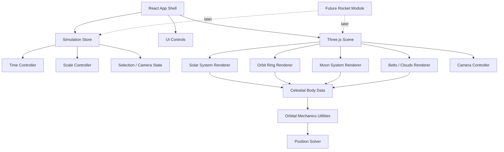

# Solar System Simulation Design Doc

## Purpose

Build a clean, minimal, Apple-style 3D web app that opens directly into an interactive solar system simulation. The first version should prioritize a beautiful, fluid, accurate-feeling solar system with approximate orbital mechanics, real orbital periods/speeds, visible orbital rings, moons, belts/clouds, and time controls.

Rocket launches are intentionally excluded from the MVP, but the architecture should reserve a clear extension point for existing and futuristic rockets in a later phase.

## User Decisions

- Platform: web app.
- Experience: 3D interactive simulation, no landing page.
- Audience: personal use by the project owner.
- Visual style: Apple-style minimal, calm, polished, uncluttered.
- Orbital model: approximate, not live JPL/NASA ephemeris.
- Accuracy target: accurate orbital speeds and periods, with eccentricity and inclination included where practical.
- Bodies: planets, dwarf planets, major moons, asteroid belt, Kuiper belt, notable comets/clouds where practical.
- Moons: include major moons such as Earth's Moon, Io, Europa, Ganymede, Callisto, Titan, Enceladus, Triton, and other high-value moons.
- Scale: support true distance and true size modes, plus toggles that make the system inspectable.
- Time: pause, scrub backward/forward, speed up, slow down, preset speeds, and real-time mode.
- Visual paths: show orbital rings/trails.
- MVP priority: beautiful solar system, not rockets.
- Offline: app should run offline after install.
- Data editing: simulation data should live in editable JSON/TypeScript data files.
- Save/load scenarios: not needed.

## Product Goals

1. Show the solar system in a visually elegant 3D environment.
2. Animate planets and major moons using approximate orbital elements with realistic periods and relative speeds.
3. Let the user move smoothly through time, from real-time to high-speed orbital motion.
4. Make true scale available without making the app unusable.
5. Keep the interface minimal: a focused simulation surface with contextual controls.
6. Establish clean architecture so rockets, missions, ephemeris data, and more rigorous physics can be added later.

## Non-Goals For MVP

- No rocket launching.
- No mission planning.
- No live NASA/JPL Horizons integration.
- No full n-body gravitational simulation.
- No user accounts.
- No save/load scenario system.
- No multiplayer or sharing.
- No landing/marketing page.

## Recommended Tech Stack

- App framework: Vite + React + TypeScript.
- 3D renderer: Three.js through `@react-three/fiber`.
- 3D helpers: `@react-three/drei`.
- State: Zustand or small local React state stores.
- Styling: CSS modules or vanilla CSS with design tokens.
- Math/orbits: custom TypeScript orbital utilities.
- Data: local JSON or TypeScript data modules.
- Packaging/offline: PWA support with cached static assets.

This stack keeps the app lightweight, offline-friendly, easy to reason about, and suitable for a high-quality interactive canvas.

## High-Level Architecture



## Folder Structure

Recommended folder for the implementation agent:

```text
solar-system-sim/
  package.json
  index.html
  public/
    textures/
    icons/
  src/
    app/
      App.tsx
      App.css
    data/
      bodies.ts
      moons.ts
      belts.ts
      constants.ts
    features/
      rockets/          (shipped educational rocket feature; see ROCKETS.md)
    simulation/
      timeStore.ts
      scaleStore.ts
      selectionStore.ts
      orbitalElements.ts
      solveOrbit.ts
      units.ts
    scene/
      SolarScene.tsx
      BodyMesh.tsx
      OrbitRing.tsx
      MoonSystem.tsx
      BeltCloud.tsx
      CameraRig.tsx
      Lighting.tsx
    ui/
      TopBar.tsx
      TimeControls.tsx
      ScaleControls.tsx
      ObjectInspector.tsx
      SearchCommand.tsx
    future/
      rockets/
        README.md
        flightModel.ts
        rocketCatalog.ts
```

## Data Model

Use local data files as the source of truth. Each body should have render data and orbital data separated enough that visual representation can change without corrupting the simulation model.

```ts
type CelestialBody = {
  id: string;
  name: string;
  type:
    | "star"
    | "planet"
    | "dwarfPlanet"
    | "moon"
    | "asteroidBelt"
    | "kuiperBelt"
    | "comet";
  parentId: string | null;

  physical: {
    radiusKm: number;
    meanDistanceKm?: number;
    color: string;
    texture?: string;
    axialTiltDeg?: number;
    rotationPeriodHours?: number;
  };

  orbit?: {
    semiMajorAxisKm: number;
    eccentricity: number;
    inclinationDeg: number;
    longitudeOfAscendingNodeDeg: number;
    argumentOfPeriapsisDeg: number;
    meanAnomalyAtEpochDeg: number;
    orbitalPeriodDays: number;
    epoch: string;
    elementRatesPerCentury?: {
      semiMajorAxisAu?: number;
      eccentricity?: number;
      inclinationDeg?: number;
      longitudeOfAscendingNodeDeg?: number;
      longitudeOfPeriapsisDeg?: number;
      meanLongitudeDeg?: number;
    };
  };

  render: {
    minScreenRadiusPx?: number;
    maxScreenRadiusPx?: number;
    showLabelDefault: boolean;
    trailColor?: string;
    orbitColor?: string;
  };
};
```

### MVP Body Set

Required:

- Sun.
- Mercury, Venus, Earth, Mars, Jupiter, Saturn, Uranus, Neptune.
- Earth's Moon.
- Jupiter moons: Io, Europa, Ganymede, Callisto.
- Saturn moons: Titan, Enceladus, Rhea, Iapetus.
- Uranus moons: Titania, Oberon, Ariel, Umbriel, Miranda.
- Neptune moon: Triton.
- Dwarf planets: Pluto, Ceres, Eris, Haumea, Makemake.
- Asteroid belt as a procedural cloud/ring.
- Kuiper belt as a procedural cloud/ring.

Nice after MVP:

- Phobos, Deimos.
- Charon, Nix, Hydra, Kerberos, Styx.
- Halley's Comet and a small set of notable long-period/comet examples.
- Oort cloud as a distant conceptual shell.
- Existing spacecraft as passive markers, not simulated missions.

## Orbital Mechanics

MVP should use Keplerian orbital elements rather than dynamic n-body gravity.

Each object with an orbit should be positioned by:

1. Compute elapsed simulation time from epoch.
2. For major planets with JPL rates, resolve date-specific elements from J2000
   plus per-century rates; otherwise convert elapsed time to mean anomaly using
   orbital period.
3. Solve Kepler's equation for eccentric anomaly.
4. Convert to true anomaly.
5. Compute orbital plane position using semi-major axis and eccentricity.
6. Rotate by argument of periapsis, inclination, and longitude of ascending node.
7. Add parent body position.

This gives realistic elliptical/inclined motion while remaining fast and deterministic.

### Why Not N-Body In MVP

Full gravitational simulation is expensive, harder to keep stable at extreme time scales, and unnecessary for the desired first version. Keplerian motion is accurate enough visually and architecturally cleaner for an interactive educational simulation.

## Time System

Use one central `TimeController`.

State:

- `isPaused`
- `simulationDate`
- `timeScale`
- `direction`
- `scrubDate`
- `preset`

Required controls:

- Play/pause.
- Step backward.
- Step forward.
- Scrub timeline.
- Speed slider.
- Presets:
  - Real-time.
  - 1 hour/sec.
  - 1 day/sec.
  - 1 week/sec.
  - 1 month/sec.
  - 1 year/sec.
  - 10 years/sec.
- Direction toggle: forward/backward.

The renderer should never own time directly. It should read the current simulation date from the store and derive all positions from that.

## Scale System

Real scale is important, but a purely real-scale view makes most objects too small to inspect. The app should be honest and explicit about scale mode.

Modes:

1. **Real Scale**
   - True distances.
   - True body radii.
   - Best used with object focus, labels, and camera bookmarks.

2. **Readable Bodies**
   - True distances.
   - Body sizes get a minimum visible pixel radius.
   - Useful for understanding where planets are while keeping distances honest.

3. **Compressed Distance**
   - Distances compressed with a logarithmic or power curve.
   - Body sizes remain readable.
   - Best default for beautiful browsing.

4. **System Overview**
   - Highly compressed distances.
   - Labels and orbital rings emphasized.
   - Best for seeing all major objects at once.

Controls:

- Distance scale toggle.
- Body size toggle.
- Label density toggle.
- Orbit ring visibility toggle.
- Trail visibility toggle.

The UI must clearly indicate when distances or body sizes are visually adjusted.

## Camera Behavior

The camera should be one of the app's most polished features.

Required camera modes:

- Free orbit.
- Focus selected object.
- Follow selected object.
- Solar system overview.
- Inner planets preset.
- Outer planets preset.
- Moon system preset when selecting a planet with moons.

Selection behavior:

- Clicking a planet/moon selects it.
- Search/command palette can select any object.
- Selection opens a minimal inspector panel.
- Camera smoothly animates to the object.
- Selected object has a subtle ring/halo, not a loud outline.

## Visual Design

### General

- Dark background, minimal starfield.
- No landing page.
- No decorative panels or marketing sections.
- Simulation canvas fills the viewport.
- UI floats lightly over the canvas.
- Rounded corners should be restrained.
- Text should be compact, readable, and sparse.
- Use subtle dividers, translucency, and blur carefully.
- Avoid neon sci-fi styling.
- Avoid cluttered labels.

### Celestial Bodies

Preferred MVP approach:

- Use simple but high-quality procedural materials first.
- Add texture support where available.
- Keep textures subtle and not overly saturated.
- Sun emits warm light and has a gentle glow.
- Saturn/Uranus rings should be visible and refined.
- Orbit rings should be clean thin lines.

### Labels

Modes:

- Minimal: only selected object and major planets.
- Standard: planets, dwarf planets, selected moon system.
- Full: all known visible objects.

Labels should scale with distance and avoid overlapping as much as practical.

## UI Layout

First screen:

- Fullscreen 3D solar system.
- Slim top bar:
  - app title or current focus.
  - simulation date.
  - search icon.
  - settings icon.
- Bottom-centered time controls:
  - play/pause.
  - speed preset.
  - speed slider.
  - scrubber.
- Left or right compact inspector:
  - selected object name.
  - type.
  - distance from Sun/parent.
  - orbital period.
  - current orbital speed estimate.
  - radius.
  - moons count where applicable.
- Minimal scale/view controls:
  - scale mode.
  - labels.
  - orbits/trails.

Use icons where natural, with hover tooltips. Avoid tutorial text on screen.

## Object Inspector

For selected body, show:

- Name.
- Type.
- Parent body.
- Radius.
- Distance from parent.
- Orbital period.
- Current orbital speed.
- Rotation period if available.
- Moons list for planets.
- Focus/follow button.

Keep it compact. This should feel like an elegant info surface, not a wiki page.

## Belts And Clouds

Asteroid belt:

- Procedural ring/cloud between Mars and Jupiter.
- Thousands of tiny points or instanced meshes.
- Slight vertical variance.
- Subtle density variation.
- Do not simulate each asteroid individually in MVP.

Kuiper belt:

- Distant procedural ring/cloud beyond Neptune.
- Lower visual density than asteroid belt.
- Should be visible in compressed/system overview modes.

Oort cloud:

- Optional later conceptual shell.
- Not required for MVP.

## Trails And Orbit Rings

Orbit rings:

- Static paths derived from orbital elements.
- Thin, low-contrast, readable.
- Brighter for selected object.

Motion trails:

- Optional dynamic trails behind moving objects.
- Fade with time.
- Should be toggled independently from orbit rings.

Default:

- Orbit rings on.
- Dynamic trails off or subtle.

## Performance Strategy

- Use instancing for asteroid/Kuiper belt particles.
- Use level-of-detail for small distant bodies.
- Avoid high-poly spheres for tiny objects.
- Keep materials simple.
- Memoize orbit curves.
- Avoid recalculating static ring geometry every frame.
- Position bodies from the current simulation date each frame.
- Cap pixel ratio on high-density displays if needed.

Target:

- Smooth interaction on a modern laptop.
- Stable 60 fps preferred.
- 30 fps acceptable in full-system overview with all belts visible.

## Offline Strategy

- All body data ships with the app.
- All textures/assets are local.
- Use a service worker only if implementing PWA install/offline caching.
- No runtime API dependency in MVP.

## Future Rocket Architecture

Rockets are not part of MVP, but reserve the concept now.

Future module:

```ts
type RocketProfile = {
  id: string;
  name: string;
  category: "existing" | "nearFuture" | "theoretical";
  description: string;
  sourceConfidence: "real" | "estimated" | "speculative";
  launchModes: Array<"earthSurface" | "lowEarthOrbit" | "earthDeparture">;
  performance: {
    maxSpeedKmS?: number;
    accelerationMS2?: number;
    ispSeconds?: number;
    thrustNewtons?: number;
    wetMassKg?: number;
    dryMassKg?: number;
  };
};
```

Future flight model options:

1. **Simple Profile**
   - Rocket follows a speed/acceleration curve.
   - Good for comparing existing and futuristic rockets visually.

2. **Patched Conics**
   - Approximate interplanetary trajectories.
   - Good for destination missions and transfer windows.

3. **Physics Sandbox**
   - User can steer or apply burns.
   - More complex; not recommended until the solar system simulation is mature.

Future rocket UI:

- Launch from Earth.
- Choose rocket.
- Choose destination or free-flight.
- Show speed, distance traveled, distance from Earth, and elapsed mission time.
- Clearly label speculative assumptions for futuristic drives.

## MVP Build Plan

### Phase 1: Foundation

- Create Vite React TypeScript app.
- Add Three.js / React Three Fiber scene.
- Build fullscreen canvas with minimal UI shell.
- Add central time store.
- Add central scale/view store.

### Phase 2: Solar System Core

- Add Sun and 8 planets.
- Implement Keplerian orbit solver.
- Add orbit rings.
- Add time controls.
- Add focus camera behavior.

### Phase 3: Visual Polish

- Add lighting/glow.
- Add planet materials/textures.
- Add Saturn/Uranus rings.
- Improve camera transitions.
- Add selected-object halo.
- Add labels with density modes.

### Phase 4: Moons And Minor Objects

- Add major moons.
- Add dwarf planets.
- Add asteroid belt.
- Add Kuiper belt.
- Add inspector details.

### Phase 5: Scale And Offline

- Add real/readable/compressed/system overview scale modes.
- Add local asset caching if desired.
- Verify offline behavior.
- Tune performance.

## Acceptance Criteria

The MVP is successful when:

- The app opens directly into the 3D solar system.
- Time can be paused, scrubbed, reversed, and accelerated.
- Planets orbit with correct relative periods and approximate elliptical/inclined paths.
- Major moons orbit their parent planets.
- Orbit rings are visible and aesthetically clean.
- The user can select/focus/follow objects.
- The user can switch scale modes and understand what each mode changes.
- Asteroid and Kuiper belts are visible as elegant procedural clouds.
- The UI feels minimal and polished rather than busy.
- The app works offline after assets are installed locally.
- Rocket support can be added later without rewriting the simulation core.

## Implementation Notes For Next Agent

- Do not start with rockets. Build the solar system first.
- Keep orbital data editable and separate from rendering code.
- Keep all scale transforms centralized.
- Keep camera behavior centralized.
- Use Keplerian orbits for MVP, not n-body physics.
- Make the first screen the simulation itself.
- Avoid a landing page, feature explainer, or marketing-style hero.
- Favor a calm, high-quality interface over dense controls.
- Make sure text never overlaps controls or labels in common viewport sizes.
- Verify visually in desktop and mobile-sized browser viewports.
