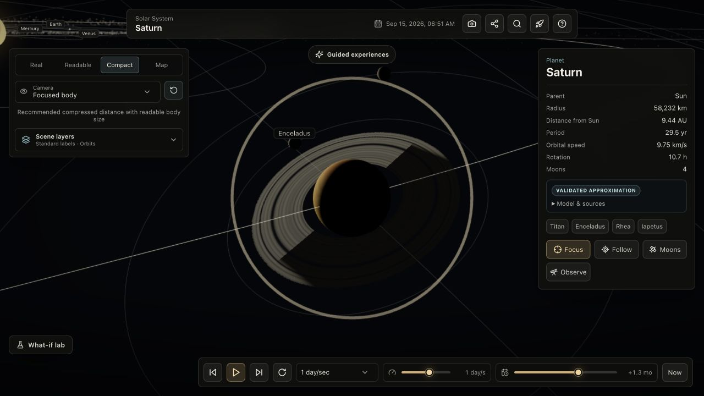

# Solar System Simulator

[](https://github.com/Akshin0906/solar-system-sim-design/actions/workflows/deploy-pages.yml)
[](https://akshin0906.github.io/solar-system-sim-design/)
[](tsconfig.json)

An interactive, offline-capable 3D solar system built with React, TypeScript, and Three.js. Explore dated orbital motion, compare physical and readable scale lenses, inspect scientific provenance, run guided scenarios, and preview educational interplanetary transfers.

[](https://akshin0906.github.io/solar-system-sim-design/)

**[Open the live simulator →](https://akshin0906.github.io/solar-system-sim-design/)**

## What it demonstrates

- A custom Keplerian orbit model with eccentricity, inclination, dated elements, moon reference planes, and body orientation.
- A visible scientific contract for every body: source, model tier, frame, validation interval, accuracy notes, and omissions.
- A responsive React Three Fiber scene with shared LOD geometry, label culling, adaptive DPR/exposure, recoverable WebGL state, and procedural fallbacks.
- Reversible camera/view sessions for guided tours, eclipse chasing, rocket watch, isolated scenarios, photo mode, and share links.
- Physical two-body Hohmann and Lambert transfers kept separate from illustrative propulsion curves and hardware evidence.
- A generated service worker with content-hashed cache versioning and an automated offline-reload test.
- Strict TypeScript, React/JSX linting, deterministic math verification, browser tests, dependency auditing, and a tested GitHub Pages deployment.

## Features

- Explore the Sun, eight planets, five dwarf planets, fifteen major moons, the asteroid belt, and the Kuiper belt.
- Play, pause, reverse, step, scrub, and accelerate simulation time.
- Switch among **Real**, **Readable**, **Compact**, and **Map** lenses with explicit scale disclosures.
- Search for bodies, inspect their live state, and use focus, follow, moon-system, or terminator-observer cameras.
- Toggle labels, orbit rings, motion trails, and ecliptic cues.
- Follow authored tours and a live model-driven eclipse chase.
- Run deterministic what-if experiments such as giant impacts, stellar evolution, and close interlopers.
- Preview free-flight, guided-direct, Hohmann, and Lambert rocket missions with flyby/capture outcomes.
- Enter photo mode, share a bounded view-state URL, and install the app for offline use.

## Quick start

Prerequisites:

- Node.js 22 or newer
- Python 3 for the scientific verification suite

```bash
npm ci
npm run dev
```

Open the address printed by Vite, normally `http://127.0.0.1:5173`.

For the browser suite, install its engines once:

```bash
npx playwright install chromium webkit
npm run test:e2e
```

## Commands

| Command | Purpose |
| --- | --- |
| `npm run dev` | Start the local Vite server. |
| `npm run lint` | Run TypeScript, React Hooks, and JSX accessibility rules. |
| `npm run typecheck` | Type-check the app, scripts, Playwright config, and browser tests. |
| `npm test` | Run app, rocket, scenario, and service-worker invariants. |
| `npm run verify:math` | Verify orbital data/math, frames, ephemeris checks, transfers, scenarios, and render budgets. |
| `npm run build` | Build the root-path production app and generate its service worker. |
| `npm run build:github` | Build the repository-prefix artifact used by GitHub Pages. |
| `npm run test:e2e` | Test desktop, mobile, reduced-motion, WebKit smoke, and offline flows. |
| `npm run check` | Run the complete static, model, behavior, and build gate. |
| `npm run check:release` | Run `check` plus the browser suite. |

## Controls

- **Rotate:** drag
- **Zoom:** scroll or pinch
- **Pan:** right-drag or two-finger drag
- **Inspect:** click or tap a body
- **Go to a body:** double-click it or choose it in Search
- **Search:** `/` or <kbd>Cmd/Ctrl</kbd> + <kbd>K</kbd>
- **Play / pause:** <kbd>Space</kbd>
- **Step one day:** <kbd>←</kbd> / <kbd>→</kbd>
- **Close the active surface:** <kbd>Esc</kbd>

## Architecture

```text
src/
  app/          Application shell and global visual system
  data/         Celestial inputs, orientations, and provenance
  features/     Guided experiences, rockets, sharing, and photo mode
  scene/        Three.js scene, camera, materials, effects, and labels
  scenarios/    Deterministic isolated gravity experiments
  simulation/   Orbits, frames, orientation, time, scale, and contracts
  ui/           Controls, inspectors, search, sheets, and accessibility
scripts/        Deterministic source, math, behavior, and budget checks
tests/e2e/      Cross-browser desktop, mobile, and PWA coverage
```

Read [Architecture](docs/ARCHITECTURE.md) for state ownership, data flow, rendering strategy, and feature boundaries.

## Scientific scope

This is an educational visualization, not an observatory-grade ephemeris or professional mission planner. Major-planet motion is an analytical approximation based on JPL elements and rates; dwarf planets use dated Horizons element snapshots; moon motion uses calibrated mean elements. The app discloses extrapolation and visual distortion instead of presenting every rendered position as equally precise.

Rocket transfer modes use idealized two-body propagation. They do not model full n-body gravity, atmospheric losses, staging, finite burns, propellant budgets, launch constraints, or vehicle feasibility.

For the detailed evidence and limitation contracts, see:

- [Scientific data and model](DATA_SOURCES.md)
- [Educational rocket model](ROCKETS.md)
- [Architecture](docs/ARCHITECTURE.md)
- [Quality and release checks](docs/QUALITY.md)

## Deployment

Pull requests and pushes to `main` run the complete GitHub Actions gate. CI builds the repository-prefix artifact first, tests that exact artifact in Chromium and WebKit, uploads it unchanged, deploys it to GitHub Pages, and verifies the live HTML, manifest, and service worker endpoints.
