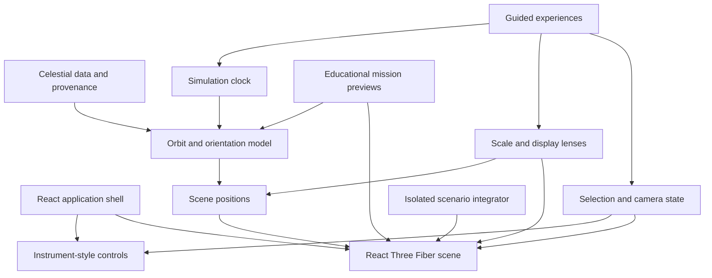

# Architecture

The simulator is a client-only React application built around a React Three Fiber scene. It keeps scientific inputs, simulation math, view state, rendering, and educational feature layers separate so visual changes do not silently alter the underlying model.

## System map

## Main layers

| Area | Responsibility |
| --- | --- |
| `src/data/` | Celestial bodies, moons, belts, orientation inputs, and scientific metadata. |
| `src/simulation/` | Kepler solving, coordinate frames, orientation, time, selection, scale transforms, and scientific contracts. |
| `src/scene/` | Three.js objects, materials, lighting, camera, labels, effects, adaptive quality, and scene composition. |
| `src/ui/` | Search, inspectors, time/scale controls, bottom sheets, keyboard behavior, focus handling, and safe preferences. |
| `src/features/` | Guided experiences, rocket previews, photo mode, and shareable views. |
| `src/scenarios/` | Deterministic isolated gravity experiments and their bounded runtime. |
| `scripts/` | Offline verification of math, source data, rendering budgets, and application invariants. |
| `tests/e2e/` | Browser coverage for desktop, mobile, PWA, accessibility, and major feature flows. |

## Scientific model boundary

The application deliberately distinguishes source data from model output:

1. `src/data/` records orbital and physical inputs plus provenance.
2. `src/simulation/scientificContract.ts` exposes source, model tier, frame, validity interval, accuracy notes, and omissions.
3. Orbit and orientation modules calculate dated states in a fixed J2000 ecliptic frame.
4. `scenePositions.ts` and the scale utilities translate physical states into a readable 3D composition.
5. The inspector shows when a result is extrapolated or visually distorted.

Only the **Real** lens uses one linear scale for both distance and radius. Other lenses make documented changes for legibility. See [the scientific model](../DATA_SOURCES.md) for source-by-source details.

## State ownership

Zustand stores own low-frequency application state:

| Store | Owns |
| --- | --- |
| `timeStore` | Simulation date, playback speed/direction, pause state, and transport locking. |
| `scaleStore` | Scale lens, label density, overlays, and persisted view preferences. |
| `selectionStore` | Selected body, camera mode, camera restores, and nested view sessions. |
| `uiStore` | Mutually exclusive sheets, popovers, and responsive UI state. |
| `experienceStore` | Reversible tours and eclipse-chase state. |
| `rocketStore` | Mission configuration and the active educational preview. |
| `scenarioStore` | Scenario parameters and low-frequency status. |

The high-frequency scenario integrator is intentionally held outside React and Zustand. The scene advances it in bounded fixed steps, which avoids rerendering the UI for each physics step and prevents unbounded background-tab catch-up.

## Rendering strategy

- React Three Fiber composes the scene and renders on demand.
- The simulation clock advances in fixed real-time slices while playback is active.
- Shared sphere LODs, label culling, adaptive DPR, adaptive exposure, and conditional effects bound GPU work.
- Curated planet textures have procedural fallbacks so a failed image does not blank a body.
- WebGL context loss is surfaced as a recoverable state, while render errors have an application-level boundary.
- Reduced-motion and coarse-pointer modes adapt camera movement and controls for accessibility.

## Feature isolation

### Guided experiences

Tours direct the existing clock, camera, and scale stores. They snapshot the visitor's state, apply temporary authored settings without overwriting saved preferences, and restore the exact prior composition on exit.

### Rocket previews

Rocket code lives under `src/features/rockets/` and never mutates celestial-body data. Illustrative direct/free curves are kept separate from two-body Hohmann and Lambert calculations. Hardware evidence is presented independently from trajectory requirements. See [the rocket model](../ROCKETS.md).

### What-if scenarios

Scenarios freeze the analytical base clock, seed an isolated deterministic integrator, and own the view until exit. Fixed-step limits, bounded backlog, fragment caps, and conservation checks keep extreme events stable without representing them as forecasts.

### Sharing and offline use

Share links serialize a validated, bounded view state. Imported views are temporary and do not replace local defaults. Production builds generate a service worker with content-hashed cache versioning that owns its cache namespace and precaches the application shell for offline reloads.

## Reliability contract

- TypeScript runs in strict mode with unused-symbol checks.
- ESLint covers TypeScript, React Hooks, and JSX accessibility.
- Pure TypeScript and Python verifiers exercise orbital math, frames, ephemeris snapshots, scale transforms, transfers, scenarios, and rendering budgets.
- Playwright tests the same base-path artifact deployed to GitHub Pages in Chromium and WebKit, including desktop, mobile, reduced-motion, and offline paths.
- CI pins third-party actions by commit SHA, audits the complete dependency tree, and uses least-privilege permissions.

See [Quality and release checks](QUALITY.md) for the complete validation workflow.
